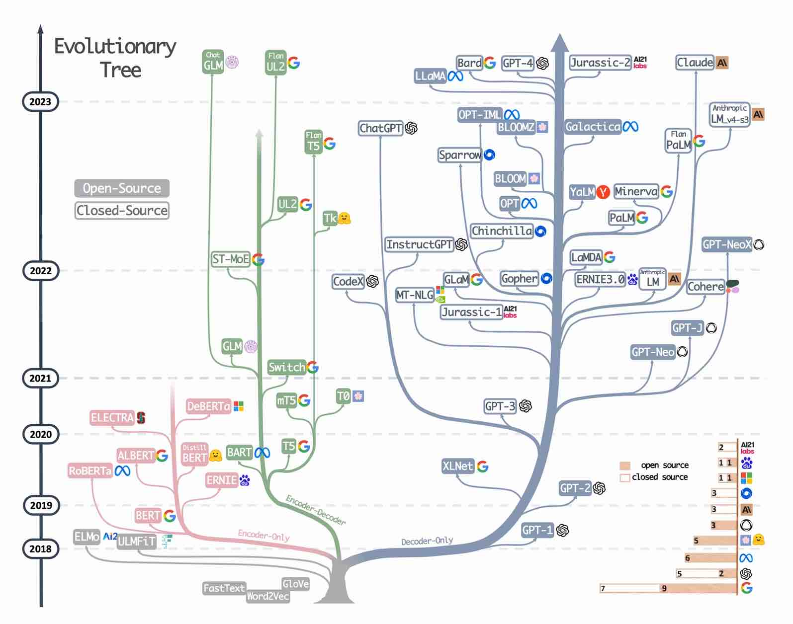
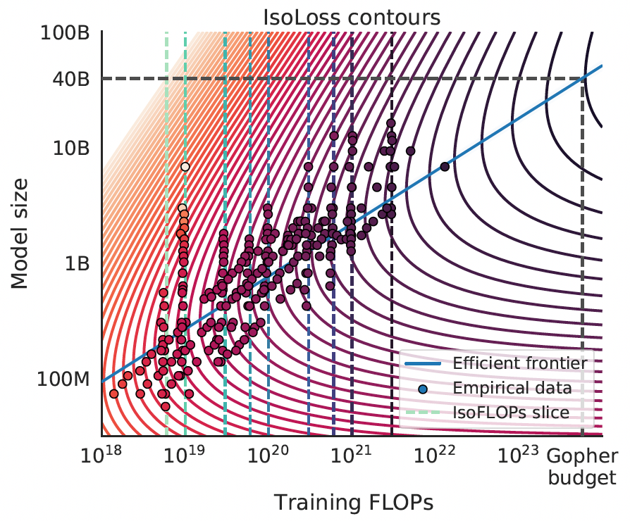
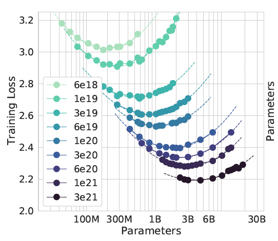
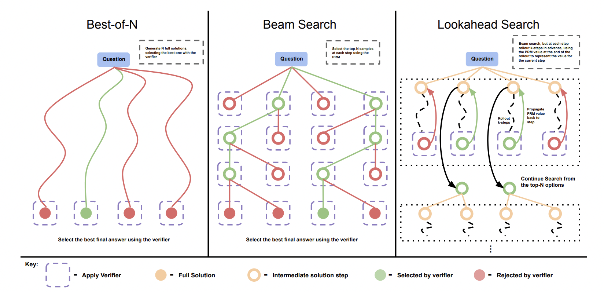
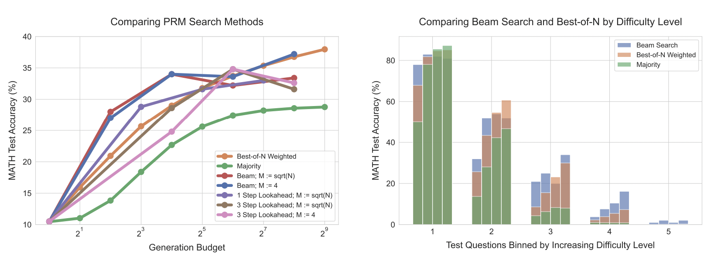
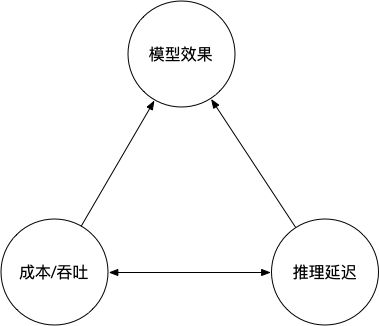
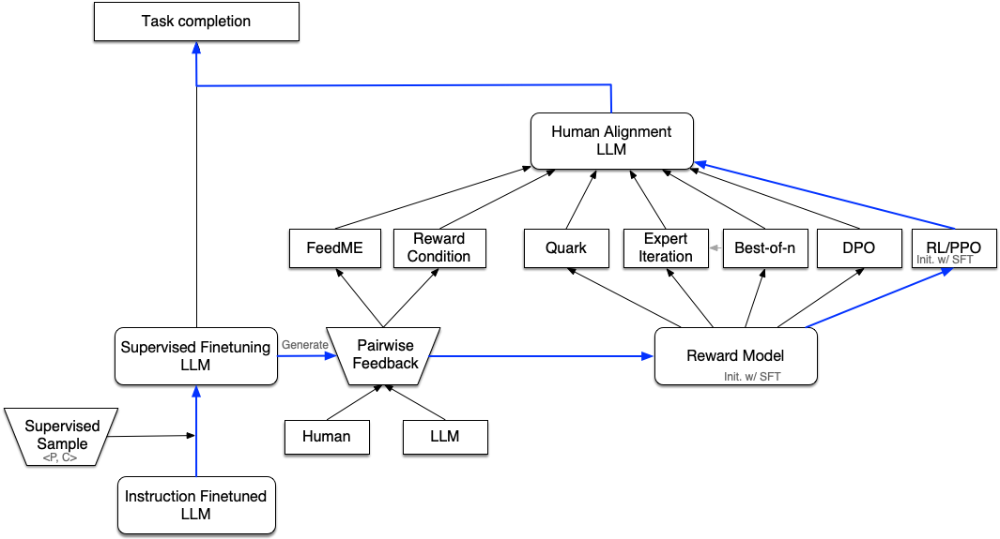
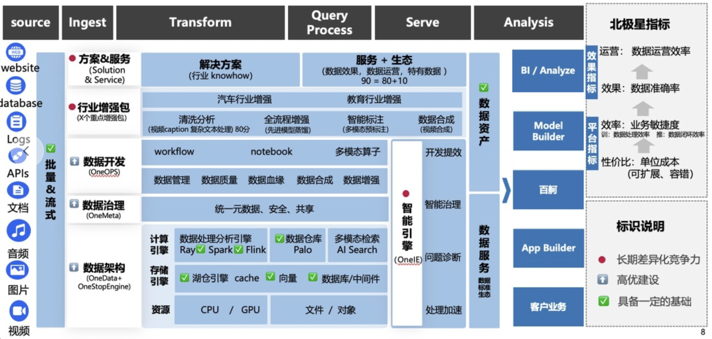

<!-- _paginate : false -->

<div class='container'>

<font size='6'>

# **大模型商业化落地的关键问题与技术挑战**

<p style="text-align:center"><span style="color:#808080"> 吴健民 (Baidu ACG)</span></p>

</font>

</div>

---
<!-- Speaker Notes -->
## Outline

1. [大语言模型技术趋势](#大语言模型技术趋势)
   1. 前GPT时代
   2. 预训练与扩展法则
   3. 测试时扩展与强化学习
   4. 商业化落地的不可能三角
2. [百度智能云大模型商业化落地](#百度智能云大模型落地实践)
   1. DataBuilder：大模型训练与应用的数据基座
   2. ModelBuilder：高效价比的模型对齐训练与推理平台
   3. AppBuilder：企业级的RAG和Agent应用开发平台
   4. 模型研发部：支持商业化落地的基座模型

---

<!-- _backgroundColor : black -->
<!-- _color : white -->
## 大语言模型技术趋势
   1. 前GPT时代
   2. 预训练与扩展法则
   3. 测试时扩展与强化学习
   4. 商业化落地与不可能三角

---
### 生成式AI的范式迁移

<font size='5'>

- AI范式迁移
  - 从: **训练**(专用) -> **预估**(专用) (> 6个月)
  - 到: **预训练**(通用) -> **模型微调**(通用/专用) -> **Prompt工程**(专用) (< 1个月)
- 新范式的关键步骤
  - 通过自回归(AR)进行预训练
  - 通过多领域样本进行指令微调
  - 场景相关样本做对齐训练
  - 通过Prompt工程与编排进行应用开发
  - 自主规划Agent

</font>

---
### 大语言模型演化树



- 仅Decoder
- 仅Encoder
- Encoder-Decoder
<!-- _footer : 'Img Source: [Jingfeng Yang et al. 2023](https://arxiv.org/abs/2304.13712)' -->

---

### Era before GPT：Encoder与判别式任务
- 文本表示：MLM
- 文本分类/情感分类/NER抽取/etc.
- BERT系列：Google
- ERNIE系列：Baidu

--- 

### Era before GPT： n-Gram语言模型
- 语言序列建模：$P(w_{1:N})$
- Markov假设：$P(w_k | w_{k-n-2:k-1})$
- 条件概率与平滑技术
- Google 1T token 5-gram corpus

<!-- _footer : '[Google n-Gram](https://research.google/blog/all-our-n-gram-are-belong-to-you/)' -->

---
### 预训练与可扩展性 (Pre-training and scaling)

<div class='columns2'>
<div>

- 自回归与Next-token-prediction(NTP)
- 扩展的维度
  - 模型参数量：< 1B, 13B, 375B, 671B, 2T
  - 训练Tokens：< 1T, 2T, 15T, 30T
  - 计算FLOPS：$O(10^{25 \sim 26})$ 级别
  - 上下文窗口长度：2k, 8k, 128k, 1M
- 平衡参数规模与训练推理效率
  - 混合精度训练：BF16/FP8
  - MoE混合专家：从稠密到稀疏
  - 注意力机制：线性/稀疏/混合

</div>

<div>




</div>

</div>

<!-- _footer : '[Training Compute-Optimal Large Language Models, 2022, Deepmind](https://arxiv.org/abs/2203.15556)' -->
---

### 扩展的一个解释：无损压缩理论

- 预测(prediction)等价于压缩(compression)：
  - $P(w_t | w_{<t})$
  - 算术编码：$w_{1:t} \to [0, 1)$
  - Shannon界与Kolmogorov界
- 对扩展的提示
  - 数据规模决定模型参数规模
  - 压缩效率与上下文长度扩展


<!-- _footer : '[Language Modeling Is Compression, 2023, Deepmind](https://arxiv.org/abs/2309.10668) <br> [An Observation on Generalization, 2023, Ilya](https://www.youtube.com/watch?v=AKMuA_TVz3A)' -->

---
### 模型扩展涌现能力：In-context Learning

Fewshot什么因素重要？
- 示例模版(instruct/CoT)与顺序: yes
- 标签空间与输入分布(多样性): yes
- 准确的 ```{Question, Answer}``` 对: no/yes

为什么会有效? 
- Topic Model的解释: $P(o|p) = \int_z P(o|z,p) P(z|p) dz$
- Induction head: ```[a][b] ... [a] -> [b]```
- 无损压缩与In-context压缩

<!-- _footer: '[A Mathematical Framework for Transformer Circuits, 2021, Anthropic](https://transformer-circuits.pub/2021/framework/index.html) <br> [How does in-context learning work?, 2022, Stanford](https://ai.stanford.edu/blog/understanding-incontext/) <br> [On the Biology of a Large Language Model，2025, Anthropic](https://transformer-circuits.pub/2025/attribution-graphs/biology.html) <br> [Larger language models do in-context learning differently, 2023, Google](https://arxiv.org/abs/2303.03846)' -->

--- 

### 预训练扩展的瓶颈 - 训练数据

- 预训练语言数据的瓶颈
  - 训练Tokens扩展：质量同分布
  - 全网公开数据趋于瓶颈
  - 私有数据分散且不易获取
  - 高质量数据合成？算力 -> 数据
- 海量视觉数据如何利用
  - 缺少有效的NTP自回归机制
  - 视觉语言编码对齐：可扩展性？

---

### 预训练扩展的瓶颈 - 模型参数量

- 万亿(T)级别参数量模型训练成本
  - DeepSeek-V3前：上亿美金
  - DeepSeek-V3后：$\sim$ 4000万人民币
- 推理成本与延迟
  - DeepSeek-V3：671B 显存占用，37B 推理激活
  - 延迟：TTFT < 1s，OTPS $\sim$ 20

---

### 生成时扩展(Test-time scaling)

<div class='columns2'>

<div>

- Prompt工程: CoT / ToT / ReAct
- 多次采样与Self-consistency
- 生成时搜索
  - Best-of-N与奖励导向的生成
  - Beam Search
  - Lookahead Search(MCTS)

</div>

<div>




</div>

</div>

<!-- _footer: '[Chain-of-Thought Prompting Elicits Reasoning in Large Language Models
](https://arxiv.org/abs/2201.11903) <br> [Self-Consistency Improves Chain of Thought Reasoning in Language Models](https://arxiv.org/abs/2203.11171) <br> [Scaling LLM Test-Time Compute Optimally can be More Effective than Scaling Model Parameters](https://arxiv.org/abs/2408.03314)' -->

---

### 后训练强化学习扩展(RL Scaling) - 激发模型自主推理做生成时扩展

- 推理能力的表现：
  - 规划(Planning)/反思(Reflexion)/验证(Verify)/探索(Exploration)
- 阶段1: 思考的模版，教导
  - ReAct：[Thought/Action/Observation]+
  - MRKL：[Thought/Action/Action Input/Observation]+
  - 解题：[知识点/分析/解答/点睛]+
- 阶段2: 奖励驱动，激发
  - 准确的奖励，数学/代码/逻辑推理
  - long-CoT热启动：Prompt模版 vs long-CoT SFT
  - 强化学习扩展：大规模（百万级）

<!-- _footer: '[ReAct: Synergizing Reasoning and Acting in Language Models, 2022](https://arxiv.org/abs/2210.03629) <br> [Kimi k1.5: Scaling Reinforcement Learning with LLMs, 2025](https://arxiv.org/abs/2501.12599) <br> [DeepSeek-R1: Incentivizing Reasoning Capability in LLMs via Reinforcement Learning, 2025](https://arxiv.org/abs/2501.12948)' -->

---

### 后训练强化学习扩展(RL Scaling) - 强化学习的核心元素

- 学习的样本：On-policy & Rollout
  - Prompt: $x \sim D$
  - Response: $y \sim \pi_{\theta}(\cdot | x)$
- 样本的Label/Reward：模型 & 规则
  - 建模环境：PRM/ORM
  - 规则系统
- 训练算法(RL)：Advantage & Reference
  - REINFORCE
  - TRPO/PPO
  - GRPO/etc

---

### 后训练强化学习扩展(RL Scaling) - 什么因素决定效果

- 基座模型能力
  - < 100B 小模型
  - DeepSeek-V3-base: 671B
- RL算法与超参数
  - PPO/GRPO/etc, $\lambda/\gamma$
  - w/ or w/o reference KL
- long-CoT能力冷启动激发
  - Prompt Template
  - CoT样本SFT
- RL样本质量与规模：百万级别样本

---

### 强化学习扩展的上限 - 奖励系统可扩展性，能否从专业到通用？

- 代码/数学/逻辑推理：Rule-based奖励
- 创作/Chatbot/角色扮演：奖励模型
- 通用奖励模型：
  - 判别式到生成式
  - 生成式到CoT推理奖励模型
- 专业领域奖励模型：领域推理能力
  - 金融：信贷风控/保险审核
  - 法律：案例判定/文书生成
  - 医疗：辅助诊疗/报告生成

<!-- _footer: '[Generative Verifiers: Reward Modeling as Next-Token Prediction, 2025, DeepMind](https://arxiv.org/abs/2408.15240) <br> [Inference-Time Scaling for Generalist Reward Modeling, 2025, DeepSeek](https://arxiv.org/abs/2504.02495)'-->

---

### 模型应用落地：效果、性能与成本的不可能三角

<div class='columns2'>

<div>

- 模型效果
  - 通用效果：文案创作/角色对话
  - 垂直能力：工具调用/结构化输出
- 推理延迟
  - TTFT：首Token耗时
  - OTPS：每秒生成Token数
- 推理成本
  - 吞吐：输入、输出TPS/单机
  - 成本：单机每秒价格/TPS

</div>

<div>



</div>

</div>

--- 

### 模型应用落地：变不可能三角为可能

- 推理加速：硬件感知的推理算法，提高计算密度
  - 算力：FLOPS
  - 带宽：访存/通信
  - 计算密度：算力/带宽
- 场景定制模型：蒸馏大模型能力到小模型
  - 垂直场景微调：SFT/DPO/RLHF
- 大小模型组合与模型路由
  - 小模型执行具体任务
  - 大模型做规划调度

--- 

### 模型应用落地：推理加速
- 基本逻辑
  - 显存占用：模型权重/kv-Cache/Activation
  - 并发吞吐：请求级别显存占用kv-Cache/Activation
- 加速手段
  - 模型结构决定推理速度：超稀疏MoE
  - 算子性能：FlashAttention/GEMM
  - 低比特量化(INT8/INT4)：Weight/Activation/kv-Cache
  - 多机并行：TP/EP/DP

---

### 模型应用落地：场景定制模型

<style>
img[alt~="center"] {
  display: block;
  margin: 0 auto;
}
</style>



--- 

### 模型应用落地：场景定制模型，有监督微调(SFT)的局限
- SFT做教导，而不是激发
- 仅学习**任务格式**以及**响应任务**的格式
- SFT的挑战：不知道大模型知道什么
  - SFT标注的知识，如果不在大模型内，会导致更多幻想
  - 大语言模型有的知识，SFT标注为 `don't know` 导致回答更保守

微调的期望的目的:
> 按照要求的格式，准确输出语言模型的知识，对不确定内容带一定不确定的语气，不知道的内容回复不知道

<!-- _footer: '[Talk of John Schulman @ EECS Berkeley, 2023/4/24](https://news.berkeley.edu/2023/04/24/berkeley-talks-transcript-chatgpt-developer-john-schulman/)'-->

---

### 模型应用落地：场景定制模型，强化学习可增强SFT后模型的诚实度
- 大语言模型知道自己知道什么
  - 概率(Logits)大小与不确定性
- RLHF可以利用模型的自知性
  - 奖励函数设计: `correct answer=1`, `don't know=0` and `wrong answer=-4`
  - 强化学习可以得到一个最大化奖励的概率阈值
- 没有真实的奖励函数, 通过奖励模型/规则实现
  - 奖励模型: **相对指标**，通过人类标注的有序对来训练
  - 奖励规则: 有限领域有效，依赖领域know-how
  - 开放问题: 人类标注的数据，是否能训练出超越人类智能的模型？
- 生成与验证Gap（generation-verification gap）

<!-- _footer: '[Language Models (Mostly) Know What They Know, 2022, Anthropic](https://arxiv.org/abs/2207.05221) <br> [Talk of John Schulman @ EECS Berkeley, 2023/4/24](https://news.berkeley.edu/2023/04/24/berkeley-talks-transcript-chatgpt-developer-john-schulman/)'-->

---

<!-- _backgroundColor : black -->
<!-- _color : white -->
## 百度智能云大模型落地(MaaS)
- DataBuilder
- ModelBuilder
- AppBuilder

--- 

### DataBuilder：大模型训练与应用的数据基座



---

### ModelBuilder：高效价比的模型对齐训练与推理平台


---

### AppBuilder：企业级的RAG和Agent应用开发平台


---

### 百度智能云模型研发部：研究大模型落地的基础问题

- **目标：** 在行业场景和垂直能力上，研发在效果/性能/成本方向上有显著优势的大模型，形成行业影响力，探索模型落地的能力上限
- **在研方向：**
  - 视觉理解多模态方向
  - 模型推理能力行业增强方向
  - 模型评估与奖励模型研发方向
  - 大规模数据清洗合成方向
  - 创新研究方向

--- 

## Thanks & QA? 
