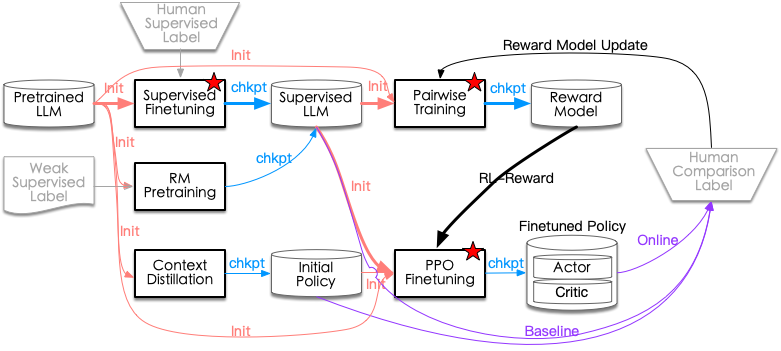

<!-- _paginate : false -->
# <!-- fit --> **Introduction to Large Language Models(LLM)**

---
<!-- Speaker Notes -->
## Outline
1. [Overview from 30,000 feet above](#overview-from-30000-feet-above)
1. [Transformer in nutshell](#transformer-in-nutshell)
1. [Pretraining - Parallel paradigm](#pretraining)
1. [Finetuning - Parameter efficient finetuning](#finetuning)
1. [Steering the decoding of LLM - Prompting](#steering-the-decoding-process-of-llm)
1. [Augmentation and Plugins](#augmentation-and-plugins)

---

## Overview from 30000 feet above
- Paradigm transition in AI
  - From: **training**(specific) -> **prediction**(specific)
  - To: **pretraining**(general) -> **finetuning**(general/specific) -> **in-context prompting**(specific)
- Primary steps of new paradigm
  - Pretraining with self-supervised learning
  - Finetuning on instruction from mutiple domains
  - Application by steering the decoding process of LLM
- Where are we to AGI?
  - From explanation to prediction
  - From correlation to causality
---
## A LLMs tree

- Decoder Only
- Encoder Only
- Encoder-Decoder
<!-- _footer : 'Img Source: [Jingfeng Yang et al. 2023](https://arxiv.org/abs/2304.13712)' -->

---
<!-- _backgroundColor : black -->
<!-- _color : white -->
## Transformer in nutshell
- Transformer modules
- Aspects of alternative
- Parameter concentration
- Computation concentration

---
## Transformer modules

- Token & positional embedding : 
  - $E \in R^{V \times d}$, $P \in R^{T \times d}$ 
- Multi-head attention
  - Self-attention & Cross-attention
    - Weight matrix: $W_Q^h, W_K^h, W_V^h \in R^{d \times d_h}$
    - Head projection: $W_O \in R^{d \times d}$
- ResNet & LayerNorm
- Feedfoward Network
  - $W_1 \in R^{d \times 4d}$, $W_2 \in R^{4d \times d}$
- Output head: task related

||
|:--:|
| Source : [Wiki:Transformer_(machine_learning_model)](https://en.wikipedia.org/wiki/Transformer_(machine_learning_model))|

<!-- _footer: '[nanoGPT](https://github.com/karpathy/nanoGPT)' -->
---
## Aspects of alternative
- Efficient Transformer (for long sequence)
  - Coarse sequence resolution: 
    - Block/Stride/Clustering/Neural Memory
    - TransformerXL
  - Attention matrix approximation:
    - Linear Transformer
- LLMs specific
  - **Encoder** vs **Decoder** vs **Encoder-Decoder**
  - Pretraining objective
  - Positional encoding
  - Input or output LayerNorm
  - Activation
---

## Parameter concentration
**Decoder only** Transformer(GPT)
- Parameter size: 
   - Embedding: $(V + T) \times d$
   - Attention: $L \times (3 \times d \times d_h \times H  + (d_h \times H) \times d) = 4Ld^2$
   - FFN: $L \times ((d \times 4d + 4d) + (4d \times d + d)) \approx 8Ld^2$
- On GPT3-175B:

 | Total | PE | TE | Attn | FFN | 
 | --- | --- | --- | --- | --- | 
 | 174,597M | 25M(0.01%) | 617M(0.35%) | 57,982M(33.21%) | 115,970M(66.42%) |

<!-- - Parameter report in [Table 2.1 in GPT3 paper](https://arxiv.org/abs/2005.14165) -->
<!--  -->
 
---
## Computation concentration 
**Decoder only** Transformer
Per-token calculation:
- QKV+project: $2 \times L \times (3 \times H \times h_d \times d + (H \times h_d) \times d) = 2 \times 4Ld^2$
- Attention: $2 \times L \times T \times d$
- FFN: $2 \times L \times ((d \times 4d + 4d) + (4d \times d + d)) \approx 2 \times 8Ld^2$

Model training flops utilization(MFU):
- Forward and backward: $(1+2) \times (2N + 2LTd) \approx 6N$, where $N \approx 12Ld^2$
- Theoretical peak throughput: $\frac{P}{6N+6LTd}$
- $\text{MFU}=\frac{\text{Observed throughput}}{\text{Theoretical peak throughtput}}$

---
<!-- _backgroundColor : black -->
<!-- _color : white -->

## Pretraining
- Training objectives
- Text Corpus
- Parallel strategies
- Results & Evaluation

---
## Training objectives
- Auto-regressive Language Models
- Missing token prediction

---
## Text Corpus
- Unsupervised text
  - [BookCorpus](https://yknzhu.wixsite.com/mbweb): 7000 unpublished books
  - [WebText](https://huggingface.co/datasets/openwebtext): 8M outlinks of Reddit.com
  - [Common Crawl](https://commoncrawl.org/)
- Week supervised text
  - Summarization: [Reddit TL;DR](https://huggingface.co/datasets/reddit)
  - QA: [StackExchange]()
- Supervised text
  - Summarization: 
  - Q&A: 
  - Dialog: InstructGPT

---
<!-- _backgroundColor : gray -->
<!-- _color : white -->
## Parallel strategies
- Why bother?
- Four parallel paradigms
  - Data parallel
  - Model parallel
    - Tensor parallel
    - Pipeline parallel
  - Sequence parallel 
- Combined implementations
---

### Why bother?

- Too big to fit in single GPU memory
  - 175B: 350GB in fp16, $\sim 3 \times 350$GB for training
    - Model: parameter, gradient, optimizer states(momentum, variance), activation
  - A100 spec: 
    - GPU memory: 80GB
    - GPU memory bandwidth: 2039GB/s; NVLink: 600GB/s; PCIe 4.0: 64GB/s
    - tf32: 156TFlops
- Speedup
  - Scales linearly with # of cores? 

---
### Data parallel: DDP/FSDP/Deepspeed
- Design Aspects
  - Storage: whole model
  - Computation & communication overlap: yes
  - Transformer only: DP no, FSDP/Deepspeed yes

<!-- _footer: '[ZeRO: Memory Optimizations Toward Training Trillion Parameter Models, Microsoft, 2019](https://arxiv.org/abs/1910.02054)   ' -->

---
### Tensor parallel: Megatron-LM

<!-- _footer: '[Megatron-LM: Training Multi-Billion Parameter Language Models Using Model Parallelism, Nvida, 2019](https://arxiv.org/abs/1909.08053)' -->

---
### Pipeline parallel: GPipe

<!-- _footer: '[GPipe: Efficient Training of Giant Neural Networks using Pipeline Parallelism, Google, 2018](https://arxiv.org/abs/1811.06965)' -->

---
### Sequence parallel

<!-- _footer: '[Sequence Parallelism: Long Sequence Training from System Perspective, HPC-AI, 2021](https://arxiv.org/abs/2105.13120)'-->

---
### Combined implementations: Megatron-DeepSpeed/ColossalAI

<!-- _footer: '[Colossal-AI: A Unified Deep Learning System For Large-Scale Parallel Training, HPC-AI, 2021](https://arxiv.org/abs/2110.14883)   [Megatron-DeepSpeed](https://github.com/microsoft/Megatron-DeepSpeed)' -->

---
<!-- _backgroundColor : gray -->
<!-- _color : white --> 
## <!-- fixing --> End of Parallel strategies
---
## Result & Evaluations
---
<!-- _backgroundColor : black -->
<!-- _color : white -->
## Finetuning
- Target and issues
- Instruct finetuning
- Finetuning for specific task
- Parameter efficient finetuning

---

## Target and issues
- Target
  - From pattern completion to real world tasks
- Issues
  - Instruction following
  - Hallucination
  - Toxicity and ethics
  - Securities

---
## Instruct Finetuning

Key to success
- Number of finetuning datasets: 
  - scaling from 62 text datasets to 18K
- Model scale: 137B LaMDA-PT
- Natural language instructions

<!-- _footer: '[Finetuned Language Models Are Zero-Shot Learners, 2021, Google](https://arxiv.org/abs/2109.01652)  [Scaling Instruction-Finetuned Language Models, 2022, Google](https://arxiv.org/abs/2210.11416)' -->
---

## Finetuning for specific task

<!-- _footer: '[Finetune from HF(OpenAI):1909.08593](https://arxiv.org/abs/1909.08593)    [Summarize from HF(OpenAI):2009.01325](https://arxiv.org/abs/2009.01325)   [HHHA(Anthropic):2112.00861](https://arxiv.org/abs/2112.00861)   [InstructGPT(OpenAI):2203.02155](https://arxiv.org/abs/2203.02155)   [HHA(Anthropic):2204.05862](https://arxiv.org/abs/2204.05862)  [Sparrow(Deepmind):2209.14375](https://arxiv.org/abs/2209.14375)'-->

--- 

### Problems from Supervised Finetuning(SFT)
- Learning only the task format and the way to response for the format
- Knowledge labeled but not in the LLM leads to more hallucination
- Knowledge in the LLM but labeled as `don't know` leads to withhold information

What we want from finetuning: 
> outputs its(LLM's) state of knowledge with the correct amount of hedging and expressing its uncertainty

<!-- _footer: '[Talk of John Schulman @ EECS Berkeley, 2023/4/24](https://news.berkeley.edu/2023/04/24/berkeley-talks-transcript-chatgpt-developer-john-schulman/)'-->

---

### Advance of RL to SFT for truthfullness
- LLMs know what they know
  - Calibrated probability, uncertainty
- RLHF can leverage the self-awareness
  - Design reward function: `correct answer=1`, `don't know=0` and `wrong answer=-4`
  - RL learn optimal threshold of probability to maximize the reward
- No oracle for the correctness, delegate to Reward Model
  - Reward model: **relative criteria** trained by pairwise loss from human feedback
  - Open problem: true probabilites of everything?
  - Open problem: go beyond things that labelers can easily do
    - Verification is easier than generation

<!-- _footer: '[Anthropic: 2207.05221](https://arxiv.org/abs/2207.05221)   [Talk of John Schulman @ EECS Berkeley, 2023/4/24](https://news.berkeley.edu/2023/04/24/berkeley-talks-transcript-chatgpt-developer-john-schulman/)'-->

---

## More on Reinforcement Learning

- Catalog of algorithms(**PPO belongs**)
  - World model or **model free**
  - Value-based or **policy-based(actor-critic)**
  - MC or **TD bootstrapping**
  - Off-policy or **on-policy**
  - Deterministic or **stochastic** policy
- Design consideration
  - **Sample efficiency**: Off-policy > On-policy
  - **Stability & Convergence**: Deadly Triad issue
  - **Explore & Exploit**: Random at episode beginning
  - **Bias & Variance**: Advantage Function

<!-- _footer: '[SpinningUp: OpenAI](https://spinningup.openai.com/en/latest/)' -->

--- 

<!-- _backgroundColor : gray -->
<!-- _color : white --> 
## Parameter Efficient Finetuning

- Design aspects
- Primary implementations
  - Adapter
  - Prefix-tuning
  - LoRA

---

## Methods and performance on Summerization task

|  |  |
| -- | -- |
| <td colspan='2'> PEFT illustration and performance comparison (Source: [Junxian He, et.al](https://arxiv.org/abs/2110.04366)) |

---

## Design aspects
- **Finetuned Modules**:
  - Attention-key/value matrix: LoRA(Q/V)
  - Attention-head: Prefix-Tuning(K/V)
  - Attention: Adapter
  - After FFN: Adapter
- **Other aspects**:
  - Multi-task consideration
  - Task related head

---
## Adapter

- Implementation & training notes
  - $h \leftarrow h + f(h W_{\text{down}})W_{\text{up}}$
  - Parameter scale: $2 \times L \times (r \times d + r + d), r \ll d$
  - Adapt after FFN sub-layer works too
- Results
  - Finetune BERT for 26 classification Tasks
    - 3.6% parameters for 0.4% GLUE performance gap
  - Ablation: fewer layers adapted -> worser performance

<!-- _footer: '[Adapter: Parameter-Efficient Transfer Learning for NLP, Google, 2019](https://arxiv.org/abs/1902.00751)'-->

---
## Prefix-Tuning

- Implementation
  - $\text{head} = \text{Attn}(X W_Q, [P_K; XW_K], [P_V; XW_V])$
  - Reparameterization for finetuning stability: 
    - $[P_K, P_V] = \text{MLP}_\theta (P^E)$
    - $P^E$: prefix embedding
- Parameter scale: 
  - Vanilla: $|P| \times d \times 2 \times L$
  - Reparameteration: $|P| \times d + d \times H + H \times d \times 2 \times L$ 

<!-- _footer: '[PrefixTuning: Optimizing Continuous Prompts for Generation, Stanford, 2021](https://arxiv.org/abs/2101.00190)' -->

---
## More on Prefix-Tuning: Training and scaling
- Training
  - Initialization: 
    - Real/high frequency words activation
    - *Task relevant words* / *Classification labels*
  - LM Head: Next Token/Class Label
- Results & discussion
  - Finetuning $0.1\% \sim 3\%$ parameters, comparable or better performance
  - Optimal prefix length varies: longer for more complex tasks
  - Reparameterization works task-dependently

<!-- _footer: '[PrefixTuning: Optimizing Continuous Prompts for Generation, Stanford, 2021](https://arxiv.org/abs/2101.00190)   [PromptTuning: The Power of Scale for Parameter-Efficient Prompt Tuning, Google, 2021](https://arxiv.org/abs/2104.08691)   [P-Tuning v2: Prompt Tuning Can Be Comparable to Fine-tuning Universally Across Scales and Tasks, Tsinghua, 2021](https://arxiv.org/abs/2110.07602)' -->

---
## LoRA
- Implementation & training notes
  - Transformer: $W = W_0 + (BA)^T, A \in R^{r \times d}, B \in R^{d_h \times r}, r \ll \min \{d_h, d\}$
  - $W_Q$ and $W_V$ considered, parameter scale: $2 \times 2 \times d \times r \times L$
  - Modularized: `Embedding`, `Linear`, `MergedLinear`, `Conv2D`
  - Initialization: $A$ kaiming-random, $B$ zeros
  - Weight merged for inference efficiency
- Results
  - For 175B GPT-3 finetuning: 0.01% parameters , on par or better results
  - No additional inference computation and latency
  - Additivity for **finetuning merge** and **incremental update**

<!-- _footer: '[LoRA: Low-Rank Adaptation of Large Language Models, Microsoft, 2021](https://arxiv.org/abs/2106.09685)' -->

---

## More on LoRA: which part to update & rank settings 

<!-- _footer: '[LoRA: Low-Rank Adaptation of Large Language Models, Microsoft, 2021](https://arxiv.org/abs/2106.09685)' -->

---
<!-- _backgroundColor : gray -->
<!-- _color : white -->
## End of Parameter Efficient Finetuning
---

<!-- _backgroundColor : black -->
<!-- _color : white -->
## Steering the decoding process of LLM
- Decoding strategies
- Prompt enginneering
---
## Decoding strategies
- Temperature in decoding: $p_i = \frac{\exp(o_i/T)}{\sum_j \exp(o_j/T)}$
- Maximization search
  - Greedy search
  - Beam search
- Sampling
  - top-K sampling
  - top-p(Nucleus) sampling
  - Repetition penalized sampling
- Guided decoding
  - $score(x_{t+1}, b_{t}) = score(b_{t}) + \log p(x_{t+1}) + \sum_i \alpha_i f_i(x_{t+1})$
---

## Prompting engineering
- Instruction/Zero-shot prompting
- Few-shot Prompting
- In-context Learning(Prompting)
- Chain-of-Thought

---

## More on In-context Learning
Why it works? 
- Interpretation from Topic Model
- Induction head
- View from gradient descent

---

<!-- _backgroundColor : black -->
<!-- _color : white -->
## Augmentation and Plugins
- Augmented Language Models
- Automatic prompting
- Plugins

---

<!-- _backgroundColor : gray -->
<!-- _color : white -->
## Augmented Language Models
- Problems in vanilla LLMs
- Two augment aspects
   - Retrieval augmented language models
   - Tool augmented language models

---
## Problems in vailla LLMs
---
## Retrieval augmented language models
---
## Tool augmented language models
---
<!-- _backgroundColor : gray -->
<!-- _color : white -->
## End of Augmented Language Models
---
## Automatic prompting
---
<!-- _backgroundColor : gray -->
<!-- _color : white -->
## Plugins
- Plugins ecosystem
- Primary implementations
  - Langchain Agent/Tool
  - ChatGPT Plugins
  - Fixie
  - Other paradigm proposal
---
## Plugins ecosystem
- Tool as a service
- From SEO to LMO
- Orchestration by LLM

---
## Langchain Agent/Tool
---
## ChatGPT Plugins
---
## Fixie
---
## Other paradigm proposal
---
<!-- _backgroundColor : gray -->
<!-- _color : white -->
## End of Plugins

---

Thanks & QA? 
