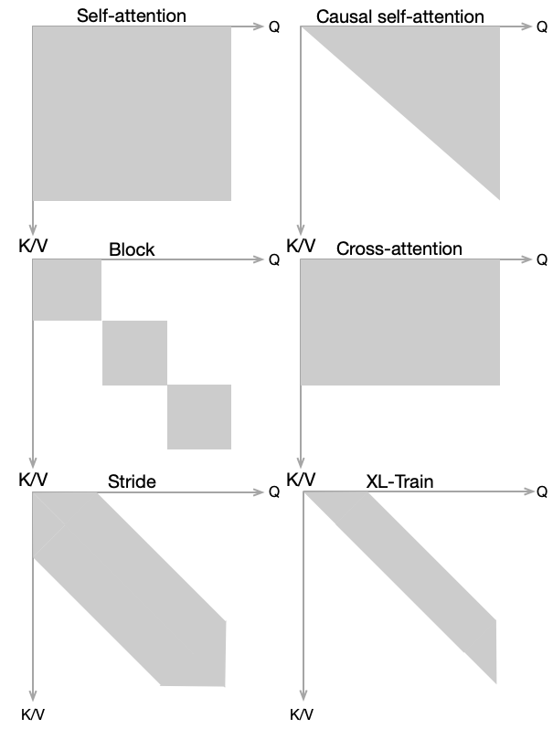
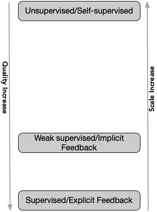
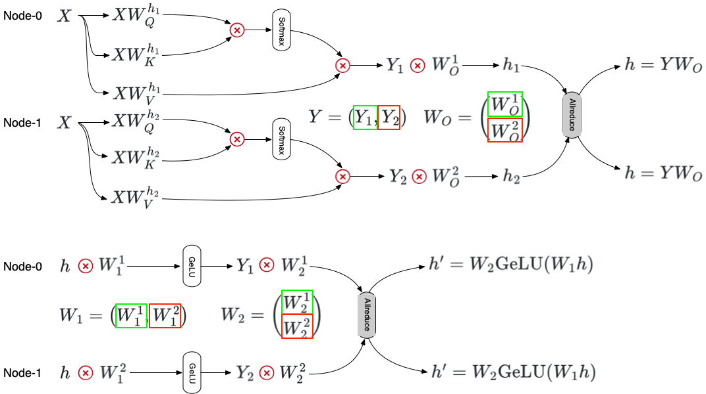
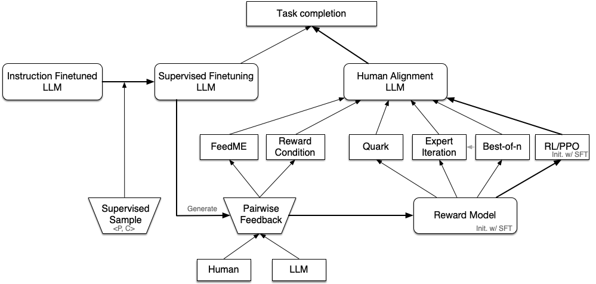
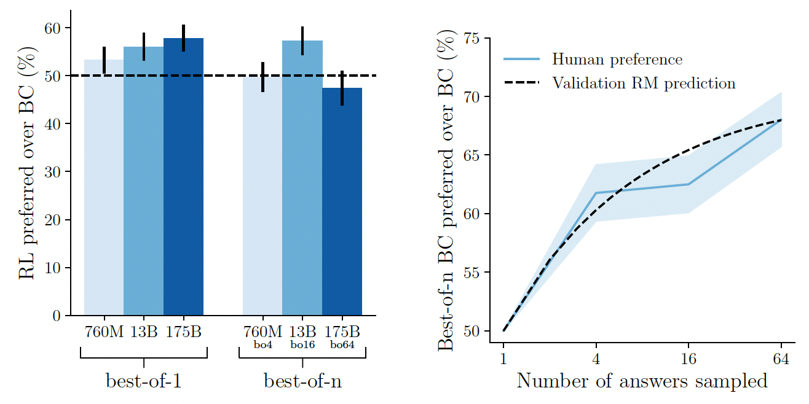

<!-- _paginate : false -->
# <!-- fit --> **Introduction to Large Language Models(LLM)**

---
<!-- Speaker Notes -->
## Outline
1. [Overview from 30,000 feet above](#overview-from-30000-feet-above)
1. [Transformer in nutshell](#transformer-in-nutshell)
1. [Pretraining - Parallel paradigm](#pretraining)
1. [Finetuning - Parameter efficient finetuning](#finetuning)
1. [Steering the decoding of LLM - Prompt](#steering-the-decoding-process-of-llm)
1. [Augmentation and Plugins](#augmentation-and-plugins)

---

## Overview from 30000 feet above
- Paradigm transition in AI
  - From: **training**(specific) -> **prediction**(specific)
  - To: **pretraining**(general) -> **finetuning**(general/specific) -> **in-context prompt**(specific)
- Primary steps of new paradigm
  - Pretraining with self-supervised learning
  - Finetuning on instruction from mutiple domains
  - Supervised Finetuning & RLFH
  - Application by steering/prompt the decoding process of LLM
- Where are we to AGI?
  - From explanation to prediction
  - From correlation to causality

<!-- _footer: '[AI and the future of humanity, 2023, Yuval Noah Harari](https://www.youtube.com/watch?v=LWiM-LuRe6w)' -->

---
### A LLMs Evolution Tree


- Decoder Only
- Encoder Only
- Encoder-Decoder
<!-- _footer : 'Img Source: [Jingfeng Yang et al. 2023](https://arxiv.org/abs/2304.13712)' -->

---
<!-- _backgroundColor : black -->
<!-- _color : white -->
## Transformer in nutshell
- Transformer modules
- Aspects of alternative
- Parameter concentration
- Computation concentration

---
### Transformer modules
<div class='columns2'>
<div>

- Token & positional embedding : 
  - $E \in R^{V \times d}$, $P \in R^{T \times d}$ 
- Multi-head attention
  - Self-attention & Cross-attention
    - Weight matrix: $W_Q^h, W_K^h, W_V^h \in R^{d \times d_h}$
    - Head projection: $W_O \in R^{d \times d}$
- ResNet & LayerNorm
- Feedfoward Network
  - $W_1 \in R^{d \times 4d}$, $W_2 \in R^{4d \times d}$
- Output head: task related

</div>
<div>

||
|:--:|
| <font color='gray' size='4'>Source : [Wiki:Transformer_(machine_learning_model)](https://en.wikipedia.org/wiki/Transformer_(machine_learning_model))</font>|

</div>
</div>

<!-- _footer: '[nanoGPT](https://github.com/karpathy/nanoGPT)' -->
---
### Aspects of alternative
- Efficient Transformer (for long sequence)
  - Coarse sequence resolution: 
    - Block/Stride/Clustering/Neural Memory
    - TransformerXL
  - Attention matrix approximation:
    - Linear Transformer
- LLMs specific
  - Encoder vs **Decoder** vs Encoder-Decoder
  - Positional encoding: 
    - Absolute/**Relative**
    - Learned/**Fixed**
  - LayerNorm: **Input**/Output
  - Activation: GeLU



---

### Parameter concentration
**Decoder only** Transformer(GPT)
- Parameter size: 
   - Embedding: $(V + T) \times d$
   - Attention: $L \times (3 \times d \times d_h \times H  + (d_h \times H) \times d) = 4Ld^2$
   - FFN: $L \times ((d \times 4d + 4d) + (4d \times d + d)) \approx 8Ld^2$
- On GPT3-175B:

 | Total | PosEnc | TermEnc | Attn | FFN | 
 | --- | --- | --- | --- | --- | 
 | 174,597M | 25M(0.01%) | 617M(0.35%) | 57,982M(33.21%) | 115,970M(66.42%) |

<!-- - Parameter report in [Table 2.1 in GPT3 paper](https://arxiv.org/abs/2005.14165) -->
<!--  -->
 
---
### Computation concentration 
**Decoder only** Transformer
Per-token calculation:
- QKV+project: $2 \times L \times (3 \times H \times h_d \times d + (H \times h_d) \times d) = 2 \times 4Ld^2$
- Attention: $2 \times L \times T \times d$
- FFN: $2 \times L \times ((d \times 4d + 4d) + (4d \times d + d)) \approx 2 \times 8Ld^2$

Model training flops utilization(MFU):
- Forward and backward: $(1+2) \times (2N + 2LTd) \approx 6N$, where $N \approx 12Ld^2$
- Theoretical peak throughput: $\frac{P}{6N+6LTd}$
- $\text{MFU}=\frac{\text{Observed throughput}}{\text{Theoretical peak throughtput}}$

<!-- _footer: '[PaLM: Scaling Language Modeling with Pathways, 2022, Google](https://arxiv.org/abs/2204.02311) <br> [Chinchilla: Training Compute-Optimal Large Language Models, 2022, Google](https://arxiv.org/abs/2203.15556)'-->

--- 

### Scaling laws and compute optimal LLM training

Optimal combination of model size $N$ and token size $D$, given the computation FLOPS $C$
<div class='columns2'>

<div>

**Optimal $N$ and $D$:**
- $N_{\text{opt}} \propto {C}^a$ 
- $D_{\text{opt}} \propto {C}^b$
- OpenAI(2020) : $a=0.73, b=0.27$
- Deepmind(2022) : $a=0.5, b=0.5$ 
  - Match between training tokens and LR schedule
  - Tested on larger model size($\gt 500M$ vs. $\lt 100M$)
- Optimal ratio: $N:D \simeq 1:20$

</div>

<div>

**IsoFLOP profiles(Deepmind, 2022):**


</div>

</div>

<!-- _footer: '[Scaling Laws for Neural Language Models, 2020, Deepmind](https://arxiv.org/abs/2204.02311) <br> [Chinchilla: Training Compute-Optimal Large Language Models, 2022, Google](https://arxiv.org/abs/2203.15556)'-->

---
<!-- _backgroundColor : black -->
<!-- _color : white -->

## Pretraining
- Training objectives
- Text Corpus
- Parallel strategies
- Results & Evaluation

---
### Training architecture & objectives

- Architecture
  - Encoder: BERT series
  - Encoder-Decoder: T5(11B)
  - (Causal-)Decoder: GPTs/Ernie3.0 Titan
  - Prefix-Decoder: GLM
- Objectives
  - Masked LM: BERT/GLM/T5
  - Auto-regressive LM: T5/GPTs/Ernie3.0 Titan
  - Multi-task pretraining: GLM/Ernie3.0 Titan


---

### Text Corpus
- Unsupervised text
  - [BookCorpus](https://yknzhu.wixsite.com/mbweb) : 11,000; [Gutenberg](https://www.gutenberg.org/) : 70,000 
  - [OpenWebText](https://skylion007.github.io/OpenWebTextCorpus/): 8M outlinks of Reddit.com
  - [Common Crawl](https://commoncrawl.org/); [C4](https://www.tensorflow.org/datasets/catalog/c4)
  - Code: [BigQuery](https://cloud.google.com/bigquery?hl=zh-cn) [Github](https://huggingface.co/datasets/codeparrot/github-code)
- Weak supervised text
  - [Reddit TL;DR](https://webis.de/data/webis-tldr-17.html); [PushShift.io Reddit](https://arxiv.org/abs/2001.08435): Posts
  - [StackExchange](https://archive.org/details/stackexchange) : Question & Answer w/ score
- Supervised text: task related
  - ~16 NLP tasks related datasets (Sentiment/QA/Reasoning, etc.)
  - Human answer to prompt: InstructGPT/ShareGPT



---
### Baidu Ernie 3.0 Titan: 260B

<div class='columns2_left_2o3'>

<div>

- 2 Types of transformer modules
  - Universal module
  - Task specific module
- 3 Levels of pretraining tasks
  - Word aware: Knowledge integrated LM
  - Structure aware: sentence reordering task
  - Knowledge aware: controllable LM task
- 4D hybrid parallelism for training
  - Shared data parallel with ZeRO(2D)
  - Intra-layer tensor parallel(D)
  - Inter-layer pipeline parallel(D)

</div>

<div>


</div>

</div>

---
<!-- _backgroundColor : gray -->
<!-- _color : white -->
## Parallel strategies
- Why bother?
- Three parallel paradigms
  - Data parallel: ZeRO
  - Model parallel
    - Tensor parallel: Megatron-LM
    - Pipeline parallel: GPipe
- Combined implementations: DeepSpeed/ColossalAI
---

### Why bother?

- Too big to fit in single GPU memory
  - 175B: $\sim (2+2+3 \times 4) \times 175=2800$GB for mixed-precision training
    - Parameter & gradient(FP16): parameter($W$), gradient($g$, $\frac{\partial L}{\partial W}$)
    - Optimizer State(FP32): parameter, momentum($m$), variance($v$)
    - Activation(FP16): $2 \times (1 + 4 + 1) \times d \times B \times T \times L$
  - A100 Spec: 
    - GPU memory: 20MB SRAM, 80GB HBM
    - GPU memory bandwidth: SRAM 19TB/s; HBM 2039GB/s; NVLink: 600GB/s; PCIe 4.0: 64GB/s
    - TF32: 156TFlops
- Speedup
  - Scales linearly with # of GPU cores?

---
### Basics on Forward & Backward and Parallel Ops


<div class='columns2'>

<div>

Forward: 
$h_0 = \sigma (z_0)$ 
$z_1 = W^T h_0 + b$
$h_1 = \sigma (z_1)$

</div>

<div>

Backward:
$(\frac{\partial L}{\partial h_1},W) \rightarrow \frac{\partial L}{\partial h_0}$
$(\frac{\partial L}{\partial h_1}, h_0) \rightarrow \Delta \frac{\partial L}{\partial W}$
$m \leftarrow \beta_1 m + (1-\beta_1) \frac{\partial L}{\partial W}$
$v \leftarrow \beta_2 v + (1-\beta_2) \left( \frac{\partial L}{\partial W} \right)^2$
$W \leftarrow W - \frac{\alpha}{\sqrt{\hat{v}}+\epsilon} \hat{m}$
</div>

</div>


---
### Data parallel: from DDP to FSDP(ZeRO)
- *Pesudo code* for DDP and FSDP 
<div class='columns2'>

<div>

```
# forward pass :
for layer_i in layers: 
  forward pass for layer_i
# backward pass :
for layer_i in layers:
  backward pass for layer_i
  full: all-reduce gradients for layer_i
  full: update momentum & variance
  full: update weights
```

</div>

<div>

```
# forward pass :
for layer_i in layers:
  all-gather full weights for layer_i
  forward pass for layer_i
  discard full weights for layer_i
# backward pass:
for layer_i in layers:
  all-gather full weights for layer_i
  backward pass for layer_i
  discard full weights for layer_i
  part: reduce-scatter gradients for layer_i
  part: update momentum & variance
  part: update weights
```

</div>

</div>

- Advantages of ZeRO
  - Parameter & gradient and optimizer states evenly shard to $N$ nodes
  - Computation and communication overlaps

<!-- _footer: '[ZeRO: Memory Optimizations Toward Training Trillion Parameter Models, Microsoft, 2019](https://arxiv.org/abs/1910.02054) <br> ' -->

---
### Tensor parallel: Megatron-LM

<div class='columns2_left_1o3'>

<div>

- $W_Q, W_K, W_V$ partition by head(col)
- $W_O$ partition by row
- $W_1$ partition by col, $W_2$ by row
- Backward Allreduce for gradient

</div>

<div>



</div>

</div>

<!-- _footer: '[Megatron-LM: Training Multi-Billion Parameter Language Models Using Model Parallelism, Nvida, 2019](https://arxiv.org/abs/1909.08053)' -->

--- 

### Performance comparison of Megatron-LM and ZeRO

<div class='columns2_left_2o3'>

<div>

- Experiment hardware: 
  - **Megatron-LM**: 32 DGX-2H servers: 512 V100, 32GB
  - **ZeRO**: 25 DGX-2 servers: 400 V100, 32GB
  
- Flops and MFU:
  - **Megatron-LM**: 15.1 PFlops, 8.3B Model
    - 29.5 TFlops/GPU (=76% $\times$ 39 TFlops single GPU, 30% of peak Flops)
    - **MFU=76% $\times$ 30%=22.8%** 
  - **ZeRO**: 15 PFlops, 100B Model
    - 38 TFlops/GPU

</div>

<div>

Speedup for **Megatron-ML**:


Speedup for **ZeRO**:


</div>

<div>

---
### Pipeline parallel: GPipe

<div class='columns2_left_1o3'>

<div>

- Layer-wise model partition
- Re-materializaion: output activation stored and communicated
- Pipeline reduce bubble ratio from $\frac{K-1}{K}$ to $\frac{K-1}{M+K-1}$

</div>

<div>


</div>

<!-- _footer: '[GPipe: Efficient Training of Giant Neural Networks using Pipeline Parallelism, Google, 2018](https://arxiv.org/abs/1811.06965)' -->

---
### Combined implementations: Megatron-DeepSpeed/ColossalAI

<div class='columns2'>

<div>

Megatron-DeepSpeed
- Data/Model parallel supported(3D)
- ZeRO-Offload
- Sparse attention
- 1-bit Adam and 0/1 Adam
- MoE specific parallelism
- RLHF Demo: deepspeed-chat
</div>

<div>

ColossalAI
- Data/Model parallel supported(3D)
- 3D Tensor parallelism
- ZeRO-Offload: model data supported
- MoE specific parallelism
- RLHF Demo: ColossalChat

</div>

</div>

<!-- _footer: '[Colossal-AI: A Unified Deep Learning System For Large-Scale Parallel Training, HPC-AI, 2021](https://arxiv.org/abs/2110.14883) <br> [Megatron-DeepSpeed](https://github.com/microsoft/Megatron-DeepSpeed)' -->

---
<!-- _backgroundColor : gray -->
<!-- _color : white --> 
## <!-- fixing --> End of Parallel strategies
---

## Result & Evaluations

<div class='columns2'>

<div>

**Evaluation Set**
- GLUE/SuperGLUE
- MMLU
- C-Eval
- AGIEval
- GSM8k/MATH
- HumanEval(code)
- Big-bench(Hard)

</div>

<div>

**C-Eval Accuracy**: <span style="color:#D3D3D3">YY: 47+ </span>


</div>

</div>

<!-- _footer: '[Holistic Evaluation of Language Models, 2022, Stanford](https://arxiv.org/abs/2211.09110) <br> [C-Eval: A Multi-Level Multi-Discipline Chinese Evaluation Suite for Foundation Models, 2023, SJTU](https://arxiv.org/abs/2305.08322)' -->

---
<!-- _backgroundColor : black -->
<!-- _color : white -->
## Finetuning
- Target and issues
- Instruct finetuning
- Finetuning for specific task
- Parameter efficient finetuning

---

### Target and issues
- Target
  - From pattern completion to real world task completion
- Issues
  - Instruction following
  - Hallucination
  - Toxicity and ethics
  - Securities

---

## Instruction Finetuning

<div class='columns2'>

<div>

Key to success
- Number of finetuning datasets: 
  - scaling from 62 text datasets to 18K
- Model scale: 137B LaMDA-PT
- Natural language instructions

</div>

<div>


</div>

</div>
<!-- _footer: '[Finetuned Language Models Are Zero-Shot Learners, 2021, Google](https://arxiv.org/abs/2109.01652)<br> [Scaling Instruction-Finetuned Language Models, 2022, Google](https://arxiv.org/abs/2210.11416)' -->

---

### Aligning Language Models with Self-Generated Instructions: Self-instruct


<!-- _footer: '[Self-Instruct: Aligning Language Models with Self-Generated Instructions, 2022, University of Washington](https://arxiv.org/abs/2212.10560)' -->

---

### Distill Large Foundation Model(LFM) with instruction tuning: LLaMA series


| Model Name | #Instructions | #(Base Model) | Finetuning | Instruction Synthetic |  Org.    |
|------------|------------------|----------------|-------------------|------------|----------|
| Alpaca     | 52K              | 7B             | Full   | Self-instruct  | Stanford        |
| Vicuna     | 70K              | 13B            | Full   | ShareGPT       | LM              |
| Dolly      | 15K              | 12B            | Full   | Human          | Databricks      |
| WizardLM   | 250K             | 16B            | Full   | Evol-Instuct   | Microsoft       |
| Guanaco    | 88K              | 65B            | QLoRA  | OASST1(dialog) | UW              |
  
<!-- _footer: '[QLoRA: Efficient Finetuning of Quantized LLMs, 2023, University of Washington](https://arxiv.org/abs/2305.14314) <br> [WizardLM: Empowering Large Language Models to Follow Complex Instructions, 2023, Microsoft](https://arxiv.org/abs/2304.12244) <br> [Vicuna: An Open-Source Chatbot Impressing GPT-4 with 90%* ChatGPT Quality](https://lmsys.org/blog/2023-03-30-vicuna/)  <br> [Alpaca: A Strong, Replicable Instruction-Following Model, 2023, Stanford](https://crfm.stanford.edu/2023/03/13/alpaca.html)'-->

---

### Different voice from UC Berkeley

<div class='columns2_left_2o3'>

<div>

Method and evaluation in brief:
- Base model size from 1.5B(**GPT-2**) to 13B(**LLaMA**)
- Imitation tokens from 0.3M to 150M(**NQ-synthetic** + **ShareGPT**)
- Evaluation: Crowdworkers + NLP tasks(Auto)

Conclusion:
- Imitation models are rated high by crowdworkers(**top**)
- Scaling imitation data not work on 3-shot NQ(**mid.**)
- Scaling base model parameters size helps(**bottom**)
- Mimicks ChatGPT's style not facturality capability
- Enormous and diverse imitation dataset required

</div>

<div>


</div>

</div>

<!-- _footer: '[The False Promise of Imitating Proprietary LLMs, 2023, UC Berkeley](https://arxiv.org/abs/2305.15717)' -->

---

### Scaling the size of instructions from LFM: Orca

<div class='columns2_left_2o3'>

<div>

- Enriching Imitation signal: 
  - explanation traces
  - step-by-step thought
- Scaling instructions
  - Initiated from FLAN-v2 collection
  - 5M instructions from ChatGPT(TA)
  - 1M instructions from GPT-4
- Rigorous Evaluations
  - Open-ended Generation: 
    - Vicuna/Awesome/WizardLM Prompts
  - Reasoning: AGIEval/Big-bench Hard/
  - Safety: TruthfulQA-MC

</div>

<div>


Conclusion: 
- **Explanation Tuning** effectively aligns smaller model to GPT-4
- Imitation **data size** and **coverage** is crucial

</div>

</div>


<!-- _footer: '[Orca: Progressive Learning from Complex Explanation Traces of GPT-4, 2023, Microsoft](https://arxiv.org/abs/2306.02707)' -->

---

## Finetuning for specific task

<style>
img[alt~="center"] {
  display: block;
  margin: 0 auto;
}
</style>



<!-- _footer: '[Finetune from HF(OpenAI):1909.08593](https://arxiv.org/abs/1909.08593) <br> [HHHA(Anthropic):2112.00861](https://arxiv.org/abs/2112.00861) <br> [InstructGPT(OpenAI):2203.02155](https://arxiv.org/abs/2203.02155) <br> [HHA(Anthropic):2204.05862](https://arxiv.org/abs/2204.05862) <br> [AlpacaFarm: 2305.14378](https://arxiv.org/abs/2305.14387)'-->

--- 

### Problems with Supervised Finetuning(SFT)
- Learning only the **task format** and the **way to response** for the format
- Knowledge labeled but not in the LLM leads to more hallucination
- Knowledge in the LLM but labeled as `don't know` leads to withhold information

What we want from finetuning: 
> outputs its(LLM's) state of knowledge with the correct amount of hedging and expressing its uncertainty

<!-- _footer: '[Talk of John Schulman @ EECS Berkeley, 2023/4/24](https://news.berkeley.edu/2023/04/24/berkeley-talks-transcript-chatgpt-developer-john-schulman/)'-->

---

### Advance of RL to SFT for truthfullness
- LLMs know what they know
  - Calibrated probability, uncertainty
- RLHF can leverage the self-awareness
  - Design reward function: `correct answer=1`, `don't know=0` and `wrong answer=-4`
  - RL learn optimal threshold of probability to maximize the reward
- No oracle for the correct reward, delegate to Reward Model
  - Reward model: **relative criteria** trained by pairwise loss from human feedback
  - Open problem: true probabilites of everything?
  - Open problem: go beyond things that labelers can easily do
    - Verification is easier than generation

<!-- _footer: '[Language Models (Mostly) Know What They Know, 2022, Anthropic](https://arxiv.org/abs/2207.05221) <br> [Talk of John Schulman @ EECS Berkeley, 2023/4/24](https://news.berkeley.edu/2023/04/24/berkeley-talks-transcript-chatgpt-developer-john-schulman/)'-->

---

### More on Reinforcement Learning

- Catalog of algorithms(**PPO belongs**)
  - World model or **model free**
  - Value-based or **policy-based(actor-critic)**
  - MC or **TD bootstrapping**
  - Off-policy or **on-policy**
  - Deterministic or **stochastic** policy
- Design consideration
  - **Sample efficiency**: Off-policy > On-policy
  - **Stability & Convergence**: Deadly Triad issue
  - **Explore & Exploit**: Random at episode beginning
  - **Bias & Variance**: Advantage Function


<!-- _footer: '[SpinningUp: OpenAI](https://spinningup.openai.com/en/latest/)' -->

--- 

<!-- _backgroundColor : gray -->
<!-- _color : white --> 
## Parameter Efficient Finetuning

- Design aspects
- Primary implementations
  - Adapter
  - Prefix-tuning
  - LoRA

---

### Methods and performance on Summerization task

<div class='columns2'>

<div>


</div>

<div>


</div>

</div>

<p style='text-align:center'>

PEFT illustration and performance comparison (Source: [Junxian He, et.al](https://arxiv.org/abs/2110.04366))

</p>

---

### Design aspects
- **Modules Finetuned**:
  - Attention-key/value matrix: LoRA(Q/V)
  - Attention-head: Prefix-Tuning(K/V)
  - Attention: Adapter
  - After FFN: Adapter
- **Other aspects**:
  - Multi-task consideration
  - Task related head

---
### Adapter

<div class='columns2_left_2o3'>

<div>

- Implementation & training notes
  - $h \leftarrow h + f(h W_{\text{down}})W_{\text{up}}$
  - Parameter scale: $2 \times L \times (r \times d + r + d), r \ll d$
  - Adapt after FFN sub-layer works too
- Results
  - Finetune BERT for 26 classification Tasks
    - 3.6% parameters for 0.4% GLUE performance gap
  - Ablation: fewer layers adapted -> worser performance

</div>

<div>

**Accuracy** relative to full-tuning:


</div>

</div>

<!-- _footer: '[Adapter: Parameter-Efficient Transfer Learning for NLP, Google, 2019](https://arxiv.org/abs/1902.00751)'-->

---
### Prefix-Tuning

- Implementation
  - $\text{head} = \text{Attn}(X W_Q, [P_K; XW_K], [P_V; XW_V])$
  - Reparameterization for finetuning stability: 
    - $[P_K, P_V] = \text{MLP}_\theta (P^E)$
    - $P^E$: prefix embedding
- Parameter scale: 
  - Vanilla: $|P| \times d \times 2 \times L$
  - Reparameteration: $|P| \times d + d \times H + H \times d \times 2 \times L$ 

<!-- _footer: '[PrefixTuning: Optimizing Continuous Prompts for Generation, Stanford, 2021](https://arxiv.org/abs/2101.00190)' -->

---
### More on Prefix-Tuning: Training and scaling
- Training
  - **Initialization**:
    - Real/high frequency words activation
    - *Task relevant words* / *Classification labels*
  - **LM Head**: Next Token/Class Label
- Results & discussion
  - Finetuning $0.1\% \sim 3\%$ parameters, comparable or better performance
  - Optimal prefix length varies: longer for more complex tasks
  - Reparameterization works task-dependently

<!-- _footer: '[PrefixTuning: Optimizing Continuous Prompts for Generation, Stanford, 2021](https://arxiv.org/abs/2101.00190) <br> [PromptTuning: The Power of Scale for Parameter-Efficient Prompt Tuning, Google, 2021](https://arxiv.org/abs/2104.08691) <br> [P-Tuning v2: Prompt Tuning Can Be Comparable to Fine-tuning Universally Across Scales and Tasks, Tsinghua, 2021](https://arxiv.org/abs/2110.07602)' -->

---
### LoRA
- Implementation & training notes
  - **Low-Rank**: $W = W_0 + (BA)^T, A \in R^{r \times d}, B \in R^{d_h \times r}, r \ll \min \{d_h, d\}$
  - $W_Q$ and $W_V$ considered, parameter scale: $2(AB) \times 2(QV) \times d \times r \times L$
  - **Modularized**: `Embedding`, `Linear`, `MergedLinear`, `Conv2D`
  - **Initialization**: $A$ kaiming-random, $B$ zeros
  - **Weight merged** for inference efficiency
- Results
  - For 175B GPT-3 finetuning: 0.01% parameters , on par or better results
  - No additional inference computation and latency
  - Additivity for **finetuning merge** and **incremental update**

<!-- _footer: '[LoRA: Low-Rank Adaptation of Large Language Models, Microsoft, 2021](https://arxiv.org/abs/2106.09685)' -->

---

### More on LoRA: which part to update & rank settings 


<!-- _footer: '[LoRA: Low-Rank Adaptation of Large Language Models, Microsoft, 2021](https://arxiv.org/abs/2106.09685)' -->

---
<!-- _backgroundColor : gray -->
<!-- _color : white -->
## End of Parameter Efficient Finetuning
---

<!-- _backgroundColor : black -->
<!-- _color : white -->
## Steering the decoding process of LLM
- Decoding strategies
- Prompt enginneering

---
### Decoding strategies
- Temperature in decoding: $p(w_i|w_{<i}) = \frac{\exp(o_i/T)}{\sum_j \exp(o_j/T)}$, $o_i$ logits from LLM
- Maximal Likelihood Search
  - Greedy search: $w_i = \arg \max p(w_i | w_{<i})$, eq. to $T=0$
  - Beam search: $w_i \in \text{TopN }p(w_i|w_{i-1}, w_{<i-1}) p(w_{i-1} | w_{<i-1})$
- Sampling
  - top-K sampling: $w_i = \text{sample TopK } p(w_i|w_{<i})$
  - top-p(Nucleus) sampling: $w_i = \text{sample TopK}_i\text{ } \sum_{w_i < K_i} p(w_i|w_{<i}) \ge p$
  - Repetition penalized sampling
- Guided decoding
  - $score(x_{t+1}, b_{t}) = score(b_{t}) + \log p(x_{t+1}) + \sum_i \alpha_i f_i(x_{t+1})$
---

### Prompt engineering
- One-shot interaction
  - Instruction/Zero-shot Prompt
  - Few-shot Prompt
  - In-context Learning(Prompt)
  - Chain-of-Thought
- Recursive interaction
  - MRKL: ```[Thought/Action/Action Input/Observation]+```, zero-shot, access tools
  - **Self-ask**: ```Followup question? [Question/Answer]+ Final Answer```, few-shot
  - **ReACT**: ```[Thought/Action/Observation]+```, few-shot, access tools

---

### More on In-context Learning

What matters?
- Examples template(instruct/CoT) & order: yes
- Label space & Input distribution(diversity): yes
- Exact ```{Question, Answer}``` pair: no/yes

Why it works? 
- Interpretation from Topic Model: $P(o|p) = \int_z P(o|z,p) P(z|p) dz$
- Induction head: ```[a][b] ... [a] -> [b] ```

<!-- _footer: '[A Mathematical Framework for Transformer Circuits, 2021, Anthropic](https://transformer-circuits.pub/2021/framework/index.html) <br> [How does in-context learning work?, 2022, Stanford](https://ai.stanford.edu/blog/understanding-incontext/) <br> [Rethinking the Role of Demonstrations: What Makes In-Context Learning Work?, 2022, Meta](https://arxiv.org/abs/2202.12837) <br> [Larger language models do in-context learning differently, 2023, Google](https://arxiv.org/abs/2303.03846)' -->

---

<!-- _backgroundColor : black -->
<!-- _color : white -->
## Augmentation and Plugins
- Augmented Language Models
- Plugins Ecosystem

---

<!-- _backgroundColor : gray -->
<!-- _color : white -->
## Augmented Language Models
- Pros and Cons in vanilla LLMs
- Augmentation
   - Reasoning/Planning
   - Action/Tool usage

---

## Pros and Cons in vanilla(no-augmentation) LLMs

<div class='columns2'>

<div>

Pros
- World knowledge
- Instruction Following
- Few/Zero-shot Learning
- In-context Learning
- Chain-of-Thought
- Arithmetic/Commonsense Reasoning

</div>

<div>

Cons
- Compression of world knowledge
- No up-to-date knowledge
- Context limitation
- Hallucinations

</div>

</div>

---

## Augmented Language Model Brief Overview


<div class='columns2'>

<div>

- 2-step loops in augmenting
  - What: Reasoning/Planning
  - How: Action/Tool Usage
- Equiped with **memory**: Short/Long Term

</div>

<div>

- 3 methods for augmenting
  - In-context prompt: 
    - One-shot/Recursive
  - Pretraining/Finetuning
    - Human/Self-teach
  - Reinforcement Learning: 
    - Hardcode/Human-Feedback

</div>

</div>

<!-- _footer: '[Augmented Language Models: a Survey, 2023, Meta](https://arxiv.org/abs/2302.07842) <br> [Tool Learning with Foundation Models, 2023, Tsinghua](https://arxiv.org/abs/2304.08354)'-->

---

## Planning by self-talk: Self-ask

<div class='columns2_left_2o3'>

<div>

- Multi-hop question and compositionality gap
- Self-ask prompt:
  - Few-shot prompt scaffold: 
     ```
     Question: {{Question}}
     Are follow up questions needed here: Yes
     Follow up: {{Follow-up-question}}
     Intermediate answer: {{Itermediate-answer}}
     So the final answer is: {{Final-answer}}

     Question: {{Question}}
     Are follow up questions needed here: {{LLM-gen}}
     ```
  - Few-shot prompt with search engine: 
    - The same prompt as before
    - Generated by query search engine:
     ```
     Intermediate answer: {{Itermediate-answer}}
     ```

</div>

<div>

Accuracy on *Compositional Celebrities* 2-hop questions


</div>

</div>

<!-- _footer: '[Self-ask: Measuring and narrowing the compositionality gap in language models, 2022, MetaAI](https://arxiv.org/abs/2210.03350)' -->

--- 

## Planning by self-talk: Self-ask prompt 

<font size="5">

>  **Question:** Who lived longer, Theodor Haecker or Harry Vaughan Watkins? 
>  **Are follow up questions needed here: Yes.**
>  **Follow up:** How old was Theodor Haecker when he died?
>  **Intermediate answer:** Theodor Haecker was 65 years old when he died.
>  **Follow up:** How old was Harry Vaughan Watkins when he died?
>  **Intermediate answer:** Harry Vaughan Watkins was 69 years old when he died.
>  **So the final answer is:** Harry Vaughan Watkins

>  **Question:** Who was president of the U.S. when superconductivity was discovered?
>  **Are follow up questions needed here:** <span style="background-color:#90EE90">**Yes.**
>  **Follow up:** When was superconductivity discovered?
>  **Intermediate answer:** Superconductivity was discovered in 1911.
>  **Follow up:** Who was president of the U.S. in 1911?
>  **Intermediate answer:** William Howard Taft.
>  **So the final answer is:** William Howard Taft.</span>

</font>

---

## Planning by self-talk: Self-ask prompt with search engine

<font size="5">

>  **Question:** Who lived longer, Theodor Haecker or Harry Vaughan Watkins? 
>  **Are follow up questions needed here: Yes.**
>  **Follow up:** How old was Theodor Haecker when he died?
>  **Intermediate answer:** Theodor Haecker was 65 years old when he died.
>  **Follow up:** How old was Harry Vaughan Watkins when he died?
>  **Intermediate answer:** Harry Vaughan Watkins was 69 years old when he died.
>  **So the final answer is:** Harry Vaughan Watkins

>  **Question:** Who was president of the U.S. when superconductivity was discovered?
>  **Are follow up questions needed here:** <span style="background-color:#90EE90">**Yes.**
>  **Follow up:** When was superconductivity discovered?</span>
>  <span style="background-color:#FFCCCB">**Intermediate answer:** Superconductivity was discovered in 1911.</span>
>  <span style="background-color:#90EE90">**Follow up:** Who was president of the U.S. in 1911?</span>
>  <span style="background-color:#FFCCCB">**Intermediate answer:** William Howard Taft.</span>
>  <span style="background-color:#90EE90">**So the final answer is:** William Howard Taft.</span>

</font>

---

## Synergy between reasoning and actions: ReAct prompt with tools

<div class='columns2_left_2o3'>

<div>

- Two kinds of tasks
  - **Reasoning**: multi-hop QA(HotspotQA)
  - **Decision making**: long horizon/delayed reward(WebShop)
- Space of reasoning and actions
  - **reasoning**: language generated by LLM
    - goal or question decompose
    - commonsense or arthmetic reasoning
    - search reformulation
    - answer synthesis
  - **actions**: task related
    - search/find/finish for reasoning

</div>

<div>

- ReAct $\le$ CoT-SC
- CoT-SC -> ReAct $\gt$ CoT-SC
- ReAct -> CoT-SC $\gt$ CoT-SC 
  


</div>

</div>

<!-- _footer: '[ReAct: Synergizing Reasoning and Acting in Language Models, 2022, Princeton](https://arxiv.org/abs/2210.03629)'-->

---

## *CoT* prompt

<font size="4">

> **Question** Musician and satirist Allie Goertz wrote a song about the "The Simpsons" character Milhouse, who Matt Groening named after who?
> **Thought** Let’s think step by step. Milhouse was named after U.S. president Richard Nixon, so the answer is Richard Nixon.
> **Answer** Richard Nixon

> **Question** Which documentary is about Finnish rock groups, Adam Clayton Powell or The Saimaa Gesture?
> **Thought** Let’s think step by step. Adam Clayton Powell (film) is a documentary about an African-American politician, not Finnish rock groups. So the documentary about Finnish rock groups must instead be The Saimaa Gesture.
> **Answer** The Saimaa Gesture

> **Question** What is the elevation range for the area that the eastern sector of the Colorado orogeny extends into?
> <span style="background-color:#90EE90">**Thought** Let’s think step by step. The eastern sector of Colorado orogeny extends into the High Plains. High Plains rise in elevation from around 1,800 to 7,000 ft, so the answer is 1,800 to 7,000 ft.
> **Answer** 1,800 to 7,000 ft</span>

</font>

---

## *Act* only prompt

<font size="5">

> {{Few-shot examples ahead}}
> **Question:** What is the elevation range for the area that the eastern sector of the Colorado orogeny extends into?
> <span style="background-color:#90EE90">**Action 1** Search[Colorado orogeny]</span>
> <span style="background-color:#FFCCCB">**Observation 1** The Colorado orogeny was an episode of mountain building (an orogeny) in Colorado and surrounding areas.</span>
> <span style="background-color:#90EE90">**Action 2** Lookup[eastern sector]</span>
> <span style="background-color:#FFCCCB">**Observation 2** (Result 1 / 1) The eastern sector extends into the High Plains and is called the Central Plains orogeny.</span>
> <span style="background-color:#90EE90">**Action 3** Search[High Plains]</span>
> <span style="background-color:#FFCCCB">**Observation 3** High Plains refers to one of two distinct land regions:</span>
> <span style="background-color:#90EE90">**Action 4** Search[High Plains (United States)]</span>
> <span style="background-color:#FFCCCB">**Observation 4** The High Plains are a subregion of the Great Plains. From east to west, the High Plains rise in elevation from around 1,800 to 7,000 ft (550 to 2,130m).[3]</span>
> <span style="background-color:#90EE90">**Action 5** Finish[1,800 to 7,000 ft]</span>

</font>

---

## *ReAct* prompt

<font size="4">

> {{Few-shot examples ahead}}
> **Question** What is the elevation range for the area that the eastern sector of the Colorado orogeny extends into?
> <span style="background-color:#90EE90">**Thought 1** I need to search Colorado orogeny, find the area that the eastern sector of the Colorado orogeny extends into, then find the elevation range of the area.
> **Action 1** Search[Colorado orogeny]</span>
> <span style="background-color:#FFCCCB">**Observation 1** The Colorado orogeny was an episode of mountain building (an orogeny) in Colorado and surrounding areas.</span>
> <span style="background-color:#90EE90">**Thought 2** It does not mention the eastern sector. So I need to look up eastern sector.
> **Action 2** Lookup[eastern sector]</span>
> <span style="background-color:#FFCCCB">**Observation 2** (Result 1 / 1) The eastern sector extends into the High Plains and is called the Central Plains orogeny.</span>
> <span style="background-color:#90EE90">**Thought 3** The eastern sector of Colorado orogeny extends into the High Plains. So I need to search High Plains and find its elevation range.
> **Action 4** Search[High Plains (United States)]</span>
> <span style="background-color:#FFCCCB">**Observation 4** The High Plains are a subregion of the Great Plains. From east to west, the High Plains rise in elevation from around 1,800 to 7,000 ft (550 to 2,130m).[3]</span>
> <span style="background-color:#90EE90">**Thought 5** High Plains rise in elevation from around 1,800 to 7,000 ft, so the answer
is 1,800 to 7,000 ft.
> **Action 5** Finish[1,800 to 7,000 ft]</span>

</font>

---

## Pros and Cons of Prompt-based augmentation

<div class='columns2'>

<div>

**Pros**
- Flexible for application
- Add new tool in low cost
- Easy to explanation

</div>

<div>

**Cons**
- Unstable response
- Rely on top performed LLMs
- Limited by context window size
- Token inefficient

</div>

</div>

---

## Augment LM with retrieval end-to-end: REALM(pretraining)

- Two steps of *retrieve* and *predict*
  - $P(y|x) = \sum_z P(y|z,x) P(z|x)$
  - *Neural retrieval*: $P(z|x) = \text{Softmax}_z (\text{BERT}_{\text{CLS}}(x)^T \text{BERT}_{\text{CLS}}(z))$
  - *Knowledge-augmented encoder*: $P(y|z,x)$
    - Pretraining: Masked Language Model loss of BERT
    - Finetuning: Reading Comprehension loss of BERT(assume $y \in z$)
- Practical training
  - Involve top-K documents of $P(z|x)$
  - Vector search of top-K with asynchronous index update

<!-- _footer: '[REALM: Retrieval-Augmented Language Model Pre-Training, 2020, Google](https://arxiv.org/abs/2002.08909)' -->

---

## Augment LM with retrieval end-to-end: REALM (Demo/Ablation)


<div class='columns2'>

<div>


</div>

<div>


- joint training of retrieval/encoder helps
- index update required

</div>

</div>

---

## Teach LM to use search and browse web: WebGPT(finetuning)

- Long format question-answering problem(LFQA)
- Leverage on-the-shelf knowledge retrieval & answer synthesis system
  - Bing Search API
  - GPT-3 175B
- Focus on finetuning to align with human feedback
  - **Behavior Cloning(BC)**: Supervised finetune with human *demonstrations*
  - **Reward Modeling(RM)**: Train with *comparison* feedback based on BC model
  - **Reinforcement Learning**: Finetune BC model with RM reward and BC KL penalty
  - Generation with **rejection sampling**: BC/RL on RM(Best-of-n)
<!-- _footer: '[WebGPT: Browser-assisted question-answering with human feedback, 2021, OpenAI](https://arxiv.org/abs/2112.09332)' -->

---

## Teach LM to use search and browse web: Human Feedback Tool


<!--  -->

<!-- _footer: '[WebGPT: instructions for contractors](https://docs.google.com/document/d/1dqfhj1W8P0JhwMKD5lWbhppY9JDFfm7tCwZudolmpzg/edit)' -->

---

## Teach LM to use search and browse web: Action Space & Prompt

<div class='columns2'>

<div>

- **Action Space**
  - Search {query}
  - Clicked on link {link ID}
  - Find in page: {text}
  - Quote: {text}
  - Scrolled down/up {1,2,3}
  - Top/Back 
  - End: Answer
  - End: {Nonsense, Controversial}

</div>

<div>

- **Prompt**


</div>

</div>

---

## Teach LM to use search and browse web: Main Conclusion

<div class='columns2'>

<div>


- Outperform human & reference answer
- RL shadowed by BC-best-of-n

</div>

<div>




</div>

---

## LLM self-teach to use tools: Toolformer

<div class='columns2'>

<div>

**Corpus annotation**
- Prompt LM(for each tool) and sampling **$m$** tools for **top-$K$** position
- Call APIs get $m \times K$ response
- Filter APIs for LM loss reduction $\ge$ $T_f$
- Augment corpus with remaining APIs

</div>

<div>

**LLM finetuing & prediction**
- Finetuning using standard LM objective
- Decoding as usual, stop when meeting $\rightarrow$, call corresponding API
- Fill text with API reponse, continue decoding

</div>

</div>


<!-- _footer: '[Toolformer: Language Models Can Teach Themselves to Use Tools, 2023, MetaAI](https://arxiv.org/abs/2302.04761)' -->

---

## Prompt & tools involved in Toolformer

<div class='columns2'>

<div>

**Tools involved**
- Question Answering: 
  - Atlas(Retrieval augmented QA LM)
- Calculator
- Wikipedia Search: 
  - BM25 retrieval for wikidump
- Machine Translation System
  - any lang to English trans(NLLB)
- Calendar

</div>

<div>

**Prompt for QA Tool**


</div>

</div>

---

## Results and limitations

<div class='columns2'>

<div>

**Experiment settings & results**
- GPT-J(6B) finetuned with CCNet(HQ subset of C4)
- Toolformer outperforms on QA/MLQA/math reasoning/Temporal Datasets, e.g. 3 LAMA QA subsets


</div>

<div>

**Limitations**
- No capability of tools in a chain
- No tool interaction like WebGPT
- Sensitive to exact wording of input

</div>

</div>

---

<!-- _backgroundColor : gray -->
<!-- _color : white -->
## End of Augmented Language Models

---
<!-- _backgroundColor : gray -->
<!-- _color : white -->
## Plugins
- Plugins ecosystem
- Primary implementations
  - Langchain Agent/Tool
  - ChatGPT Plugins
  - Fixie
  - Other examples in application
---
## Plugins ecosystem

- Tool as a service
- From SEO to LMO
- Orchestration by LLM

---

## Paradigm of Task-driven Autonomous Agent

<div class='columns2_left_1o3'>

<div>

- AutoGPT/BabyAGI
- Langchain Agent/Tool
- Fixie

</div>

<div>


</div>

</div>

<!-- _footer: '[Task-driven Autonomous Agent Utilizing GPT-4, Pinecone, and LangChain for Diverse Applications, 2023](https://yoheinakajima.com/task-driven-autonomous-agent-utilizing-gpt-4-pinecone-and-langchain-for-diverse-applications/)' -->

---

## Langchain Agent/Tool

<div class='columns2'>

<div>

Agent(backed by LLM) drives everything
- **prompt** with examples of planning and step-by-step actions
- **weak(description in prompt)** tool operating manual
- interact between LLM and tool with ```stop``` argument 
- reasoning trace stored in ```scratchpad```: *short memory*
- ```memory``` supported for chat history buffer: *long memory*

</div>

<div>

Implemented Agents
- **mrkl**: zeroshot, open tool-set
- **Self-ask**-with-search: Google **search**
- **ReAct**: Wiki **[search|find]**
- **chat**: **ReAct** open tool-set, action in JSON
- **conversational**: **ReAct** open tool-set, interact with human
- **conversational_chat**: **ReAct** open tool-set, user take action marked in JSON

</div>

</div>

---

## More on Langchain

---
## ChatGPT Plugins

ChatGPT drives everything
- Plugin description(in manifest) matters
- OpenAPI markdown for tool specification
- Orchestrate by ChatGPT during conversation
  - When to call
  - Which to call
  - How to call
  - Synthesis results
- Released ```functions``` argument in Chat Completions API

<!-- _footer: '[Chat Plugins](https://platform.openai.com/docs/plugins/introduction) <br> [functions argument use case](https://github.com/openai/openai-cookbook/blob/main/examples/How_to_call_functions_with_chat_models.ipynb)' -->
---

## Fixie's(startup raised 17M$) proposal

<div class='columns2'>

<div>

- Session Runner:
  - dispatch query
  - maintain the running chat log
- Fixie Agent(LLM):
  - break query into sub-queries
  - dispatch to Router
- Router Agent(Neural Search):
  - match query/agent by neural search
  - agent represented by query samples 

</div>

<div>


</div>

</div>

<!-- _footer: '[Fixie architecture](https://docs.fixie.ai/architecture/)' -->

---

## Other agent examples in application

- MM-ReAct: Microsoft
- TaskMatrix.AI: Microsoft
- Tree-of-Thoughts: Princeton University/Deepmind
- LLMs As Tool Makers: Princeton University/Deepmind

---
## LLM TechStack for in-context learning Application


---
<!-- _backgroundColor : gray -->
<!-- _color : white -->
## End of Plugins

--- 

## Important but not covered

- Practical prompt enginneering
- Text to image: 
  - Latent Diffusion Model/CLIP
  - DALL-E
  - Stable Diffusion
- Multi-modal and embodient
  - PaLM-E
  - Gato
- Quantization & efficient inference on edge device
  - [ggml by Georgi Gerganov](https://github.com/ggerganov/ggml)
  - [bitsandbytes: LLM.int8()](https://github.com/TimDettmers/bitsandbytes)/[QLoRA](https://github.com/artidoro/qlora)
- And more...

---

Thanks & QA? 
